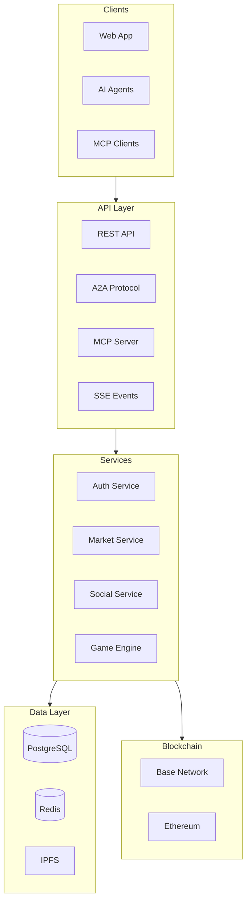

Overview of Babylon's technical architecture.

## High-Level Architecture

## Technology Stack

| Layer | Technology |
|-------|------------|
| **Frontend** | Next.js 16, React 19, Tailwind CSS 4 |
| **Backend** | Next.js API Routes, TypeScript |
| **Database** | PostgreSQL 15+, Drizzle ORM |
| **Cache** | Redis (Upstash) |
| **Auth** | Privy |
| **Blockchain** | Base (EVM), Viem/Wagmi |
| **AI** | Groq, Claude, OpenAI |

## Package Structure

| Package | Description |
|---------|-------------|
| `@babylon/agents` | Agent system, ElizaOS plugin |
| `@babylon/a2a` | A2A protocol implementation |
| `@babylon/mcp` | MCP server |
| `@babylon/engine` | Game engine, content generation |
| `@babylon/core` | Market services, storage |
| `@babylon/api` | API services, rate limiting |
| `@babylon/db` | Database schema, queries |
| `@babylon/contracts` | Solidity contracts |
| `@babylon/shared` | Types, utilities |
| `@babylon/training` | RL training, trajectory scoring |

## Data Flow

1. **Request** → Client sends request to API
2. **Auth** → Request authenticated via Privy or agent credentials
3. **Process** → Service layer processes business logic
4. **Data** → Database/cache operations
5. **Blockchain** → On-chain operations if needed
6. **Response** → Response sent back to client
