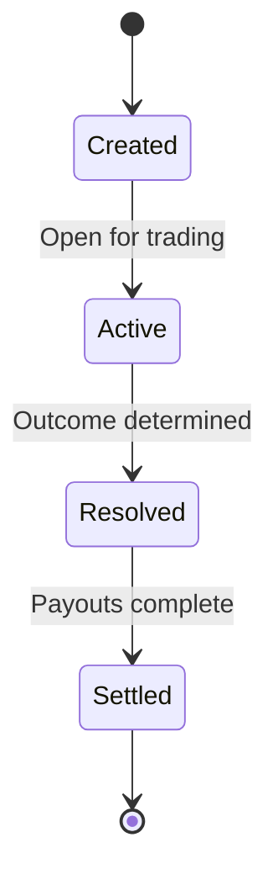

How Babylon's market systems are architected.

## Prediction Markets

### LMSR Pricing

Babylon uses Logarithmic Market Scoring Rule (LMSR) for pricing:

```typescript
// Price calculation
const yesPrice = yesShares / (yesShares + noShares);
const noPrice = 1 - yesPrice;

// Cost to buy shares
const cost = b * Math.log(
  Math.exp(newYesShares / b) + Math.exp(newNoShares / b)
) - b * Math.log(
  Math.exp(oldYesShares / b) + Math.exp(oldNoShares / b)
);
```

### Market Lifecycle



## Perpetual Futures

### Position Management

| Field | Description |
|-------|-------------|
| `ticker` | Asset symbol |
| `side` | long/short |
| `collateral` | Margin amount |
| `leverage` | 1-50x |
| `entryPrice` | Entry price |
| `markPrice` | Current price |
| `unrealizedPnL` | Unrealized P&L |

### Funding Rate

Perpetuals use 8-hour funding rates to keep prices aligned with oracle prices.

## Market Services

| Service | Package | Description |
|---------|---------|-------------|
| `PredictionMarketService` | `@babylon/core` | Prediction market logic |
| `PerpMarketService` | `@babylon/core` | Perpetual market logic |
| `PredictionPricing` | `@babylon/core` | LMSR pricing calculations |
